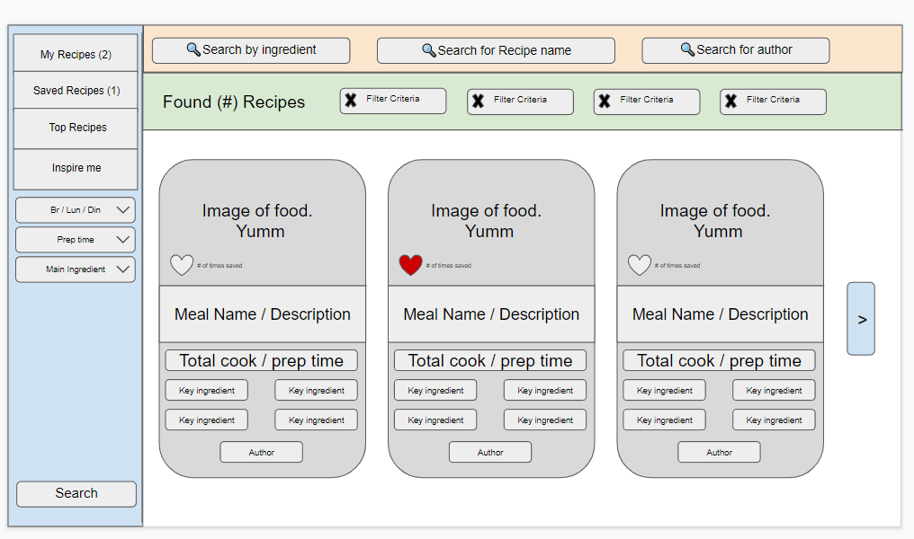

# Project-2
Title: Anyone Can Cook!
Authors: Clayton Abel, Benjamin Gomez, Hunter Sutton, Maribel Montes, Stephen Delgado

Published: [Heroku](https://nameless-shelf-34042.herokuapp.com/)
Link: [Repository](https://github.com/clabel95/Project-2)

## Project Requirements

For this project our group will use everything we have learned over the past six units to create a real-world full-stack application that we will be able to showcase to potential employers. Our project must fulfil the following requirements:

* Use Node.js and Express.js to create a RESTful API.

* Use Handlebars.js as the template engine.

* Use MySQL and the Sequelize ORM for the database.

* Have both GET and POST routes for retrieving and adding new data.

* Use at least one new library, package, or technology that we haven’t discussed.

* Have a folder structure that meets the MVC paradigm.

* Include authentication (express-session and cookies).

* Protect API keys and sensitive information with environment variables.

* Be deployed using Heroku (with data).

* Have a polished UI.

* Be responsive.

* Be interactive (i.e., accept and respond to user input).

* Meet good-quality coding standards (file structure, naming conventions, follows best practices for class/id naming conventions, indentation, quality comments, etc.).

* Have a professional README (with unique name, description, technologies used, screenshot, and link to deployed application).

## Wireframe

## Models
The models for this project were split into six different files.

The index.js file was used to give a relationship to all the other files and how they interact with eachother. 

The ingredients.js file is used to hold a specific ingredient id as well as the recipe id that the ingredient belongs to as well as the list of ingredients.

The Recipes.js file is used to hold a unique id for each recipe as well as the course type, title, key ingredient, cook time, serving size, vegitarian or not, hot or cold, instructions on how to cook, as well as the authors unique id.

The Saved_recipes.js file is used to hold the users unique id as well as the unique id of any recipes that they saved.

The User_recipe.js files is used to hold the users unique id as well as the unique id of any recipes that they have created.

The User.js file is used to hold the username, email, and password of the user.

